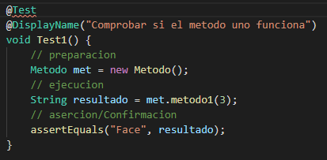

# Test de Pruebas Unitario

Un test de pruebas unitario se copone de 3 secciones:

- Preparacion.
- Ejecucion.
- Confirmacion.

## Preparacion

En la parte de la preparacion es donde se importa la clase o funcion que vamos a emplear. Un ejemplo de la forma en la que se importa es:

    Calculadora cal = new Calculadora();

## Ejecucion

En la ejecucion en donde ponemos los datos que vamos a utilizar y la funcion o clase que invocaremos. Un ejemplo de como se haria seria:

    int[] prueba = {1, 2, 3};
	String resultado = met.metodo2(prueba);

Otro ejemplo de como se haria seria:

    String resultado = met.metodo1(3);

## Confirmacion

La confirmacion tiene como utilidad comprobar si la funcion o clase que realizaste anteriormente esta bien o mal estructura. La manera de comprobarlo es:

    assertEquals("1 2 Face", resultado); 